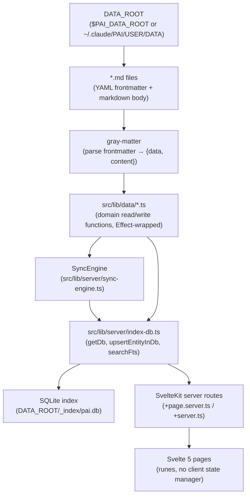
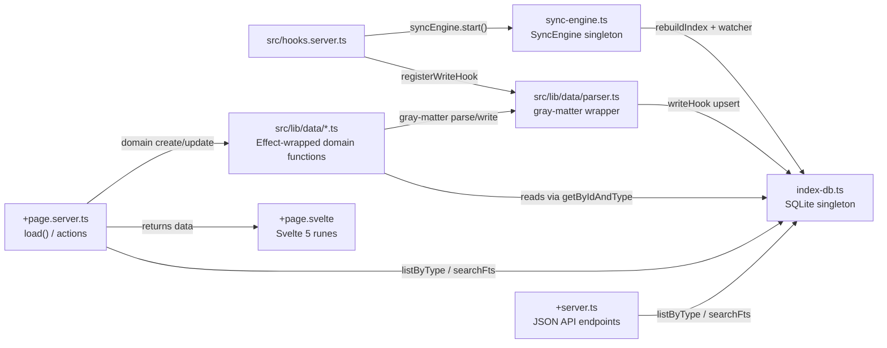

# Architecture — pai-data-ui

pai-data-ui is a SvelteKit 2 + Svelte 5 local web application that provides a browser UI over the same markdown data files used by PAI CLI skills. For setup instructions, environment variables, and production deployment, see `README.md` and `CLAUDE.md`.

---

## Data Flow

The following diagram shows the complete path from raw markdown files on disk to rendered Svelte 5 pages.

On every server start, `SyncEngine` walks `DATA_ROOT` and rebuilds the SQLite index from the current state of disk. The chokidar watcher then keeps the index live as files change. Server routes query SQLite directly (for listings and search) or call `src/lib/data/*.ts` functions (for single-entity reads and writes). There is no client-side state store: Svelte 5 pages receive data through SvelteKit's `load` functions and local rune state.

---

## Layers

### Data tier — `DATA_ROOT`

The data tier is a directory of plain markdown files. Each file encodes one entity as YAML frontmatter (fields typed by the interfaces in `src/lib/data/types.ts`) plus an optional markdown body. Every entity file must have `id` (globally unique string) and `type` (discriminant string) in its frontmatter. Files that fail this constraint are recorded in `sync_errors` but do not crash the server. The `_index/`, `_schemas/`, `_templates/`, `exports/`, and `context/` subdirectories are excluded from the sync walk.

### Server tier — `src/lib/server/`

The server tier has two modules.

`index-db.ts` is the SQLite singleton and schema owner. On first call to `getDb()`, it opens (or creates) `DATA_ROOT/_index/pai.db`, enables WAL journal mode, and initializes the three core tables plus FTS5 triggers and ValueFlows SQL views. It exposes helpers: `upsertEntityInDb`, `removeEntityFromDb`, `listByType`, `getByIdAndType`, and `searchFts`.

`sync-engine.ts` owns the indexing lifecycle. It exports a singleton `syncEngine` instance. On `start()`, it calls `rebuildIndex()` (a full walk of `DATA_ROOT`) and then starts a chokidar watcher for incremental updates.

### Routes tier — `src/routes/`

Routes are organized by domain prefix. Each route calls either `listByType` / `getByIdAndType` (for data that is already indexed) or the domain-specific functions in `src/lib/data/*.ts` (for writes or entity detail). Server routes return plain data objects to their corresponding Svelte pages. See `CLAUDE.md` for the full route prefix table.

### Component tier — `src/lib/components/`

Svelte 5 components receive data as props from their parent page. They use runes (`$state`, `$derived`, `$effect`) for local reactivity. There is no global store: data flows down through props and mutations flow up through events or server form actions. CodeMirror 6 editors (markdown and YAML), D3 charts, and the marked renderer are used in specific domain components without leaking state to the page layer.

---

## Component Relationship Map

`hooks.server.ts` is the server entry point. It registers a write hook on `parser.ts` so that any in-process write (from a form action) immediately upserts the entity into SQLite without waiting for the chokidar watcher. It then starts the `SyncEngine`, which handles files written by the CLI skills or any out-of-process editor.

---

## Design Decisions

### Markdown as source of truth

All entity data lives in markdown files under `DATA_ROOT`. SQLite is a derived index, not the authoritative store. This means the CLI skills (CRM, ERP, Projects, Focus) and the web UI operate on the same files with no sync protocol between them. The index can be fully discarded and rebuilt at any time with `bun rebuild-index`. The tradeoff is that every write must touch the filesystem, but for a single-user local application the performance is acceptable and the benefit (portable, human-readable data) outweighs it.

### Effect TS typed errors

All domain read/write functions in `src/lib/data/*.ts` return `Effect<T, DataError>`. This makes the error domain explicit at the type level: callers cannot accidentally ignore failure modes. Server routes unwrap effects with `Effect.runPromise(Effect.either(...))` and branch on `_tag === 'Left'` for structured error handling. No exceptions escape the data layer untyped.

### FTS5 full-text search

The `entities_fts` virtual table indexes the `name`, `tags`, and `body` columns of every entity using SQLite's FTS5 engine. This provides sub-millisecond full-text search across all domains with no external search service. The `searchFts` helper uses `snippet()` for excerpt generation and orders results by FTS5 `rank`. The FTS index is kept in sync with `entities` via three triggers (`entities_fts_insert`, `entities_fts_update`, `entities_fts_delete`) that fire on every mutation.

### No client-side state manager

There is no Svelte store, no Zustand equivalent, and no global reactive context. Each page loads its data through a SvelteKit `load` function and manages local UI state with Svelte 5 runes. This eliminates cache invalidation complexity: after a form action mutates a file, SvelteKit's default form action invalidation re-runs `load` and the page reflects the new state from SQLite. The constraint is that cross-page shared state must go through the URL or a server-side reload, which is the intended pattern for a local single-user app.

---

## SQLite Index

The database is located at `DATA_ROOT/_index/pai.db` and is opened in WAL (Write-Ahead Logging) mode. It is created automatically on first server start if it does not exist.

### Table: `entities`

The primary storage table. One row per markdown file.

| Column | Type | Description |
|---|---|---|
| `id` | TEXT PRIMARY KEY | Entity `id` field from frontmatter |
| `type` | TEXT NOT NULL | Entity `type` discriminant |
| `domain` | TEXT NOT NULL | First directory component under DATA_ROOT (e.g. `CRM`) |
| `file_path` | TEXT NOT NULL UNIQUE | Absolute path to the source `.md` file |
| `data` | TEXT NOT NULL | Full frontmatter serialized as JSON |
| `body` | TEXT | Markdown body content (trimmed) |
| `updated` | TEXT | Value of `updated` frontmatter field, or NULL |
| `indexed_at` | INTEGER | Unix timestamp of last index write |

Three indexes exist on `type`, `domain`, and `updated DESC` to support filtered list queries.

### Table: `entities_fts` (FTS5 virtual table)

A content-backed FTS5 virtual table that mirrors `entities`. The indexed columns are `name`, `tags`, and `body`. The `id` and `type` columns are stored but not indexed (`UNINDEXED`). The table is populated and kept current by three triggers on `entities`. Direct `INSERT` into `entities_fts` is used only by the triggers (FTS5 external content table pattern). Queries use `entities_fts MATCH ?` syntax and are ordered by the implicit `rank` column.

### Table: `sync_errors`

Tracks files that could not be indexed, either because gray-matter failed to parse them or because required `id`/`type` fields were absent. A row remains open (with `resolved_at IS NULL`) until the file is corrected and re-synced.

| Column | Type | Description |
|---|---|---|
| `id` | INTEGER AUTOINCREMENT | Primary key |
| `file_path` | TEXT NOT NULL | Path of the problematic file |
| `error_type` | TEXT NOT NULL | `parse_error` or `missing_id` |
| `error_msg` | TEXT NOT NULL | Human-readable error description |
| `raw_excerpt` | TEXT | First 500 characters of the file |
| `occurred_at` | INTEGER | Unix timestamp when the error was first recorded |
| `resolved_at` | INTEGER | Unix timestamp when the file was successfully synced, or NULL |

### ValueFlows SQL views

Four read-only SQL views are recreated on every server start (using `DROP VIEW IF EXISTS` + `CREATE VIEW`):

- `vf_economic_events`: projects tasks, expenses, income, and economic-event entities onto VF EconomicEvent fields (`vf_action`, `vf_provider`, `vf_receiver`, quantity, point-in-time).
- `vf_process_flows`: joins `entities` of type `project` with `vf_economic_events` to show which events are inputs or outputs of each process.
- `vf_agent_contributions`: aggregates work events by provider and resource spec to quantify agent contributions.
- `vf_claim_status`: projects invoices onto VF Claim fields with a computed `settlement_status`.

These views enable ValueFlows-aligned queries without modifying the entity schema.

### When the index is rebuilt

The index is rebuilt (full walk) automatically on every server start via `syncEngine.start()`. It can be rebuilt manually at any time by running `bun rebuild-index` (see `CLAUDE.md`). After the full rebuild, stale rows for files that no longer exist on disk are deleted from `entities`.

---

## SyncEngine Lifecycle

`SyncEngine` is a singleton class exported from `src/lib/server/sync-engine.ts`. Its `start()` method is idempotent: subsequent calls after the first are no-ops.

### Startup rebuild

On `start()`, `rebuildIndex()` is called synchronously. It walks every `.md` file under `DATA_ROOT` (excluding `SKIP_DIRS` and `README.md`), calls `syncFile()` on each, and removes rows from `entities` for paths that are no longer present on disk. `syncFile()` reads the file, parses frontmatter with gray-matter, validates `id` and `type`, and calls `upsertEntityInDb`. Parse failures and missing-field errors are written to `sync_errors` rather than thrown.

### Chokidar watcher

After `rebuildIndex()` completes, `startWatcher()` attaches a chokidar watcher to `DATA_ROOT/**/*.md`. The watcher ignores directories in `SKIP_DIRS` and path segments starting with `.`. It operates in non-persistent mode (it does not keep the process alive by itself). Events:

- `add` and `change`: calls `syncFile(path)`, which upserts the entity into SQLite.
- `unlink`: calls `removeEntityFromDb(db, path)`, which deletes the entity row and marks its `sync_errors` as resolved.

### Write-hook shortcut

`hooks.server.ts` registers a write hook via `registerWriteHook` on `src/lib/data/parser.ts`. When a domain function writes a file in-process (e.g., a form action creates a new contact), the hook immediately calls `upsertEntityInDb` on the written frontmatter without waiting for chokidar to detect the file change. This makes in-app writes reflect in SQLite before the next page load. The chokidar watcher still fires afterward but the upsert is idempotent, so the redundant event is harmless.

---

## References

- For environment variables, dev workflow commands, and production deployment: see `CLAUDE.md`
- For setup prerequisites, installation steps, and CLI skill linking: see `README.md`
- For entity field definitions across all domains (Contact, Opportunity, Organization, Invoice, Expense, AdHocIncome, Payment, Project, Task, FocusDaily, FocusWeek): see `src/lib/data/types.ts`
